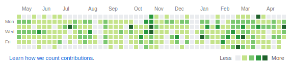

<h1 align="center">
  <br>
  <b>Fake contributions</b>
  <br>
</h1>

<h4 align="center">A cool and easy way to generate git contributions (even in the future)</a></h4>

<p align="center">
  
  
  
</p>

<p align="center">
  <a href="#overview">Overview</a> •
  <a href="#how-to-use">How to use</a> •
  <a href="#license">License</a>
</p>

<p align="center">
  
</p>

## **Overview**

This is a very simple script that allows to generate fake contributions in **Git**. Just refer to the **[script](script.sh)**, change the period you want your contributions to appear and execute it!

It's even possible to generate contributions in the future. *How about that?*

## **How to use**

First you need to make the script executable:
```
chmod a+x script.sh
```

Then you can simply run:
```
./script.sh
```

**Enjoy the result!**

## **License**

© **[Julien Cordat-Auclair](https://github.com/jcordatauclair)**
